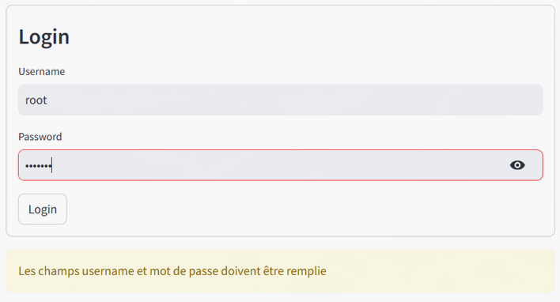
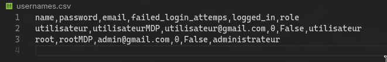

---
# **`Challenge`** 

L'application devra comporter une page d'authentification permettant d'accéder à la page d'accueil et à l’album photo du chat (ou de tout autre animal de votre choix).
Les images du chat sont disposées de manière à en avoir 3 sur la même ligne.
Les données des comptes seront issus d'un fichier csv lu avec pandas dans l'application streamlit. Ce fichier csv contiendra les colonnes suivantes :

    name, password, email, failed_login_attemps, logged_in et role

Le menu devra être placé dans la barre latérale (sidebar). Cette barre comprendra également : Déconnexion et un message de bienvenu de type Bienvenue username.
Enfin, vous devrez déployer votre application sur le cloud de Streamlit.

---
## **Crée une application Streamlit qui ressemblera aux images ci-dessous :**

  

---
## **Méthodologie**

La méthode décrite dans la quête diffère de la documentation officielle. Je choisi de suivre les instructions de la quête. Pour de futur projet, il sera préférable de suivre la documentation officielle qui offre plus de choix tel que le login Google et autres.

La quête en soit n'offre pas beaucoup de travail d'écriture de code. Le copier/coller des codes dans le cours domine la méthodologie, néanmoins il y a un travail de structure à faire afin que tout soit à sa place.

- import des librairies necessaire à la quête
```python
import pandas as pd
import streamlit as st
from streamlit_authenticator import Authenticate
from streamlit_option_menu import option_menu
```

- Création de la page de login à partir d'un fichier `.csv`


```python
df = pd.read_csv("usernames.csv")

lesDonneesDesComptes = {
    "usernames": df.set_index("name").to_dict(orient="index")
}

authenticator = Authenticate(
    lesDonneesDesComptes,  # Les données des comptes
    "cookie name",         # Le nom du cookie, un str quelconque
    "cookie key",          # La clé du cookie, un str quelconque
    30,                    # Le nombre de jours avant que le cookie expire
)

authenticator.login()
```

- Gestion du `login`
```python
if st.session_state["authentication_status"]:
    .
    .
    .
elif st.session_state["authentication_status"] is False:
    st.error("L'username ou le password est/sont incorrect")
elif st.session_state["authentication_status"] is None:
    st.warning('Les champs username et mot de passe doivent être remplie')    
```
- Création de la sidebar
```python
with st.sidebar:
        authenticator.logout("Déconnexion")
        st.write("Bienvenue")
        with st.container():
            selection = option_menu(
                    menu_title=None,
                    options = ["Accueil", "Photos"],
                    icons= ['house', 'camera']
                )
```
- Gestion des pages
```python
if selection == "Accueil":
            st.title(f"Ma page d'accueil")
            st.image('images/ONEUP.png')
    elif selection == "Photos":
            st.title(f"Mon album photos")
            col1, col2, col3 = st.columns(3)
            with col1:
                st.header("A cat")
                st.image("https://static.streamlit.io/examples/cat.jpg")
            with col2:
                st.header("A dog")
                st.image("https://static.streamlit.io/examples/dog.jpg")
            with col3:
                st.header("An owl")
                st.image("https://static.streamlit.io/examples/owl.jpg")
```

---
## **Erreur rencontrer**

#### **Erreur lors de l'import du fichier .csv**
Lors du *pd.read_csv*, la lecture met un index avec des nombres *Int* qui ne peut pas être traité par l'authentification lorsque l'on change le dataframe au format dictionnaire.
`AttributeError: 'int' object has no attribute 'lower'`
Le problème avait bien été repérer néanmoins aucune des solutions que j'ai tenté n'ont fonctionner.
J'ai tenté de gérer les index à la création du fichier csv ainsi qu'a la lecture cependant rien ne foinctionnait.
**Solution :**
la solution a été trouvé avec l'aide de L'IA. Ce qui a eu pour effet d'avoir un index avec les noms des utilisateurs. 
```python
df.set_index("name")
```

